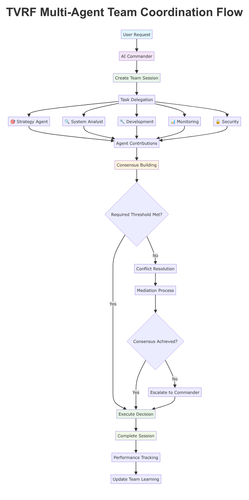
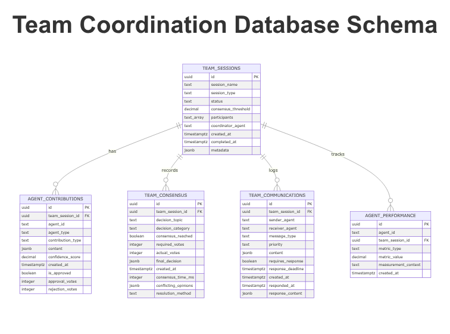

# TVRF Command Center - Multi-Agent Team Coordination

## Overview

The TVRF Command Center implements a sophisticated multi-agent architecture that enables intelligent collaboration between specialized AI agents. This system leverages the power of Claude Opus to coordinate complex tasks through consensus-driven decision making.

## Architecture



The multi-agent coordination system follows a structured workflow:

1. **Task Initiation**: User requests are processed by the AI Commander
2. **Session Creation**: A new team session is created with defined parameters
3. **Role Assignment**: Tasks are delegated to specialized agents based on their expertise
4. **Collaborative Analysis**: Each agent contributes their specialized insights
5. **Consensus Building**: Decisions are made through weighted voting mechanisms
6. **Execution**: Approved decisions are implemented with team monitoring
7. **Performance Tracking**: Team effectiveness is continuously measured and improved

## Agent Roles


### 🤖 AI Commander (Primary Coordinator)
- **Role**: Central coordination and decision authority
- **Responsibilities**: Task delegation, team coordination, conflict resolution
- **Decision Power**: Final approval authority with team consensus

### 🎯 Strategy Agent
- **Focus**: Business requirements and strategic planning
- **Expertise**: 
  - Business requirements analysis
  - Feature prioritization
  - User experience design
  - ROI and impact assessment
- **Output**: Strategic recommendations, feature specifications, user stories

### 🔍 System Analyst Agent
- **Focus**: Technical architecture and system design
- **Expertise**:
  - System architecture design
  - Performance optimization
  - Blockchain analysis (TON, TVRF)
  - Technical specifications
- **Output**: Technical designs, performance reports, system diagnostics

### 🔧 Development Agent
- **Focus**: Implementation and code generation
- **Expertise**:
  - Full-stack development
  - Code generation and review
  - Deployment strategies
  - CI/CD pipeline management
- **Output**: Production code, deployment scripts, technical documentation

### 📊 Monitoring Agent
- **Focus**: Real-time monitoring and analytics
- **Expertise**:
  - System monitoring and alerting
  - Performance metrics collection
  - Anomaly detection
  - Data visualization
- **Output**: Dashboards, alerts, performance reports, analytics

### 🔒 Security Agent
- **Focus**: Security analysis and compliance
- **Expertise**:
  - Security auditing
  - Vulnerability assessment
  - Compliance verification
  - Risk analysis
- **Output**: Security reports, compliance checks, risk assessments

## Database Schema



The team coordination system uses a specialized database schema to track:

- **Team Sessions**: Coordination sessions with metadata and participants
- **Agent Contributions**: Individual agent outputs and recommendations
- **Consensus Records**: Decision-making process and outcomes
- **Communications**: Inter-agent messaging and coordination
- **Performance Metrics**: Team efficiency and effectiveness tracking

## Consensus Mechanisms

### Decision Categories

| Category | Threshold | Use Case |
|----------|-----------|----------|
| 🔴 Critical | 80% (4/5 agents) | Security, financial, legal decisions |
| 🟡 Major | 60% (3/5 agents) | Feature development, architecture changes |
| 🟢 Minor | 40% (2/5 agents) | UI changes, minor fixes, documentation |

### Weighted Voting System

Each agent has a specialized weight based on their expertise:

```javascript
const agentWeights = {
  'SystemAnalyst': 0.25, // Technical decisions
  'Development': 0.25,   // Implementation decisions
  'Monitoring': 0.20,    // Performance decisions
  'Strategy': 0.20,      // Business decisions
  'Security': 0.10       // Security validation
};
```

### Consensus Process

1. **Input Collection**: Gather recommendations from all agents
2. **Weight Calculation**: Apply agent expertise weights
3. **Threshold Validation**: Check if consensus threshold is met
4. **Conflict Resolution**: Handle disagreements through mediation
5. **Decision Recording**: Store final decision and reasoning

## Implementation Examples

### Example 1: TVRF Platform Deployment

```javascript
// Create team coordination session
const session = await teamCoordination.createTeamSession(
  'TVRF Platform Deployment - Production',
  'development',
  'AICommander'
);

// Add agent contributions
await teamCoordination.addAgentContribution(session.sessionId, ...);
await teamCoordination.buildConsensus(session.sessionId, ...);
```

### Example 2: Emergency Response

```javascript
// Rapid emergency response
const emergency = await teamCoordination.createEmergencyResponse(
  'SystemAnomaly',
  { severity: 'HIGH', description: 'Unusual entropy patterns' }
);
```

### Example 3: Team Analytics

```javascript
// Performance analysis
const analytics = await teamCoordination.getTeamAnalytics('7d');
```

## API Endpoints

### Team Session Management
- `POST /api/team/sessions` - Create new team session
- `GET /api/team/sessions/:sessionId` - Get session details
- `POST /api/team/sessions/:sessionId/complete` - Complete session

### Agent Coordination
- `POST /api/team/sessions/:sessionId/contributions` - Add agent contribution
- `POST /api/team/sessions/:sessionId/consensus` - Build consensus
- `POST /api/team/sessions/:sessionId/messages` - Send agent message

### Emergency Response
- `POST /api/team/emergency` - Create emergency response session

### Analytics
- `GET /api/team/analytics` - Get team performance metrics

## Best Practices

### 1. Session Management
- **Clear Objectives**: Define specific goals for each team session
- **Role Assignment**: Match agent roles to their expertise areas
- **Time Management**: Set appropriate time limits for consensus building

### 2. Communication
- **Structured Messages**: Use standardized message formats
- **Priority Levels**: Set appropriate urgency levels
- **Response Deadlines**: Define clear response timeframes

### 3. Decision Making
- **Evidence-Based**: Require supporting evidence for all recommendations
- **Confidence Scoring**: Include confidence levels with contributions
- **Conflict Resolution**: Have mediation processes for disagreements

### 4. Performance Optimization
- **Efficient Consensus**: Optimize for quick consensus building
- **Resource Management**: Cache frequently accessed information
- **Load Balancing**: Distribute work evenly across agents

## Integration with TVRF System

The multi-agent coordination system is specifically designed for TVRF system management:

### TVRF Blockchain Integration
- **System Analyst** monitors blockchain health and performance
- **Development Agent** manages smart contract deployments
- **Monitoring Agent** tracks blockchain metrics and alerts

### Random Number Generation
- **Security Agent** validates entropy sources and randomness
- **System Analyst** performs statistical analysis of generated numbers
- **Monitoring Agent** tracks generation success rates

### Lottery Platform
- **Strategy Agent** manages business logic and user experience
- **Development Agent** implements game mechanics and features
- **Monitoring Agent** tracks user engagement and system performance

## Performance Metrics

### Team Efficiency
- **Consensus Rate**: Percentage of successful consensus building
- **Consensus Time**: Average time to reach consensus
- **Decision Quality**: Success rate of implemented decisions

### Agent Performance
- **Response Time**: Average agent response time
- **Accuracy**: Percentage of accurate contributions
- **Collaboration**: Team collaboration effectiveness

### System Metrics
- **Session Completion Rate**: Percentage of completed sessions
- **Error Rate**: System errors and conflicts
- **Learning Rate**: Improvement in team performance over time

## Troubleshooting

### Common Issues

1. **Slow Consensus Building**
   - Check agent response times
   - Review communication protocols
   - Optimize consensus thresholds

2. **High Conflict Rates**
   - Review agent role assignments
   - Improve communication clarity
   - Enhance conflict resolution processes

3. **Performance Degradation**
   - Monitor database query performance
   - Optimize caching strategies
   - Review agent workload distribution

### Debug Tools
- **Team Session Logs**: Detailed session execution logs
- **Communication Traces**: Inter-agent message tracking
- **Performance Dashboards**: Real-time system monitoring

## Future Enhancements

### Planned Features
1. **Machine Learning Integration**: Adaptive agent behavior based on historical performance
2. **Advanced Analytics**: Predictive analytics for team performance
3. **Integration APIs**: Direct integration with external systems
4. **Visual Dashboard**: Real-time team coordination visualization

### Extensibility
- **Custom Agent Types**: Add new specialized agent roles
- **Custom Consensus Rules**: Flexible consensus mechanisms
- **External Integrations**: Connect with third-party systems
- **Advanced Workflows**: Complex multi-phase coordination processes

## Conclusion

The TVRF Command Center's multi-agent team coordination system provides a robust, intelligent framework for managing complex system operations. Through consensus-driven decision making, specialized agent roles, and continuous learning, the system enables sophisticated problem-solving and decision-making capabilities that scale with organizational needs.

For more examples and detailed implementation guides, see the `examples/` directory and the main README.md file.